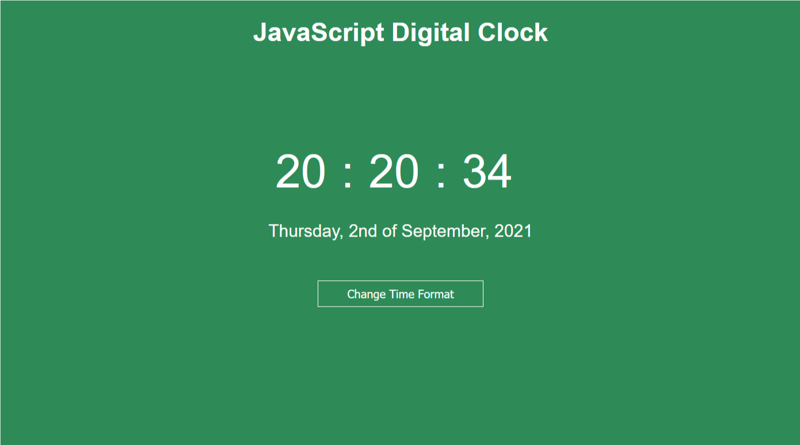

# Digital JavaScript Clock
 

 
Very simple app with almost no styling, but still a lot to learn and practice especially about Date object.
Small aditional challenge was button for toggling between 12 and 24 hour format time display.
